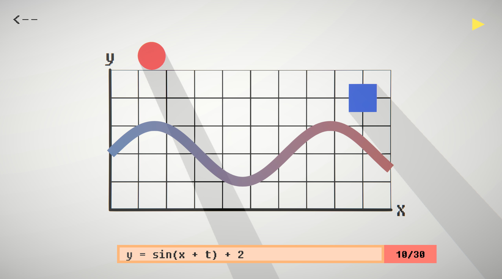

# GraphBall : 2D Graph Draw Puzzle Game

## About This Game
GraphBall is a puzzle game in which the user clears the game by drawing a graph using mathematical formulas
## System Requirements
### Windows
|Minimum|Recommended|
|-|-|
|OS: Windows10|OS: Windows10|
|Processor: Intel Core i3|Processor: Intel Core i7|
|Memory: 4 GB RAM|Memory: 8 GB RAM|
|Graphics: Intel(R) UHD Graphics 620|Graphics: NVIDIA GTX 650|
|Storage: 1GB available space|Storage: 1GB available space|
### Android
|Minimum|Recommended|
|-|-|
|OS: Android8.0|OS: Android11|
|Processor:  Qualcomm Snapdragon 855 SM8150|Processor:  Qualcomm Snapdragon 855 SM8150|
|Memory: 4 GB RAM|Memory: 8 GB RAM|
|Storage: 1GB available space|Storage: 1GB available space|
## Used Packages
- URP
- TextMesh pro
## Used Tools
- Unity
- Visual Studio 2021
